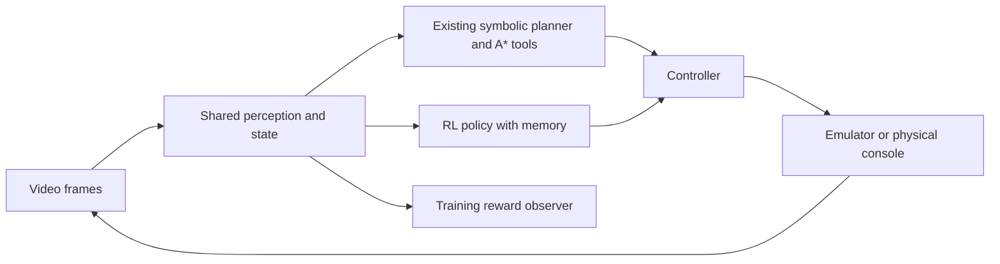
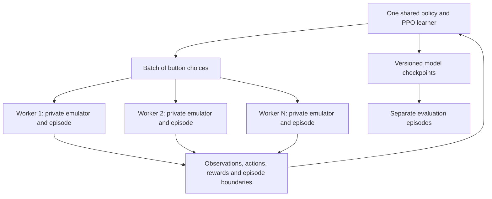

# Reinforcement learning alongside the autonomy engine

Date: 2026-09-25. Status: feasibility assessment and proposed design; no RL
engine, training run, or trained model is delivered by this document.

Inspected `autonomy` at `1607ef0`, including its in-progress worktree changes,
and `feature/emulator-fleet` at `9706cf1`. These are moving branches: recheck
interfaces before implementation. This proposal builds on the autonomy design
without replacing its symbolic planner or tile-level A* navigation.

## Recommendation

Build a second, button-level RL engine using the existing Rust emulator,
video pipeline, state representation and controller. Use Python Gymnasium,
Stable-Baselines3 and sb3-contrib RecurrentPPO for training. Start with a
curriculum of short tasks and a small pool of emulator processes, then extend
the horizon. Keep the current planner as the baseline and, optionally, a
source of demonstrations and curriculum starting saves.

The infrastructure is practical today. Learning useful navigation and battle
behaviors is a credible experiment. Completing all of FireRed from pixels
and buttons is an open-ended research objective, not a consequence guaranteed
by running enough emulators. The main risks are exploration, delayed rewards,
incorrect visual state estimates, and learning to exploit the scoring rules.

## What already exists, and what is missing

| Existing piece | Reuse | Remaining work |
|---|---|---|
| `crates/runtime/src/lib.rs` | `VideoSource -> Normalizer -> Perception -> EventExtractor -> GameState`, controller commands, recording | A bounded action/observation transaction for RL |
| `crates/state` | Screen, party level/HP/status, badges, pose, knowledge provenance | A stable numeric observation schema with missing/stale indicators |
| `crates/agent/src/goal.rs` | Existing `GoalPlanner` and goal execution | Engine selection above this loop; its plan-of-intents interface is not a raw-button policy interface |
| `crates/agent/src/track.rs` and tools | Dialogue facts, badge/healing recognition, battle tracking | Make required observations available independently of which agent is acting |
| `adapters/emulator-libretro/src/device.rs` | Fast stepped emulation and the normal controller | Independent worker processes; one libretro instance per process |
| `feature/emulator-fleet:apps/pokebot-cli/src/fleet.rs` | Worker isolation, private saves, lifecycle management, hub visibility | RL task type and trainer integration; it currently launches `new-game`, `story`, and `observe`, not RL steps |
| Recorder and telemetry | Debugging and watching selected workers | Reward breakdowns, episode statistics, policy version and training metrics |

Important: a field existing in `GameState` does not mean it is continuously
populated by perception. Some events are produced by the current task/tool
code. Raw-button play must exercise the shared visual detectors without
silently running those tools. The current `PartyMon` has level and HP fields
but no cumulative XP field; XP reward needs a confirmed text/event detector.

## Engine boundary

Only one engine controls a game instance at a time. Keep existing commands
working; add an explicit engine choice to a shared session entry point or
initially expose an independent `rl` command. Names below are proposed APIs,
not commands that currently work:

- `planned`: today's autonomy planner and its tools.
- `rl`: learned policy selects buttons; no planner intervention during a rollout.
- `assisted` (later): explicit planner fallback or learned high-level choices.
  Report interventions and evaluate this mode separately from unassisted RL.

Do not force button policies into `GoalPlanner::plan`, which returns a
multi-step symbolic plan. Share runtime/device/session infrastructure and
give the RL engine its own observe/decide/act loop. The default goal remains
game completion; curriculum runs can expose a task identifier or goal target.
Any supplied target is part of the declared observation, not hidden help.

Use the existing perceptual knowledge in the first model. An ablation using
only image history can come later. Neither model may read emulator RAM,
hidden flags, or parsed save contents. Static game data and facts inferred
from screen evidence remain available under the existing architecture.

## Observations and buttons

Use a Gymnasium `Dict` observation:

- A normalized game image. Preserve the full 240x160 view initially; benchmark
  a smaller image later while keeping OCR on full-resolution frames.
- A bounded numeric vector: screen category, visible party HP and levels,
  known badges, menu location, and visually established position when known.
- Validity, provenance and age for state estimates; unknown HP is not zero HP.
- Previous action and elapsed game frames. Optional curriculum goal encoding.

Use a small CNN plus feature encoder and LSTM. The LSTM carries context across
menus, scrolling and temporarily invisible facts. Reset its state separately
for each completed episode. RecurrentPPO provides a `MultiInputLstmPolicy` for
mixed observations; benchmark it against ordinary PPO with short frame
history before assuming recurrence improves learning. [RecurrentPPO docs](https://sb3-contrib.readthedocs.io/en/master/modules/ppo_recurrent.html)

Initial action space: `NOOP, UP, DOWN, LEFT, RIGHT, A, B, START`.
Other game buttons can be added when needed. Do not expose emulator reset,
save loading or system controls as policy actions. A useful initial experiment
is 8 frames held plus 16 released for every action, with NOOP releasing all
buttons for all 24 frames. This timing is a hypothesis for FireRed and must
be calibrated against movement and menu behavior, including the adapter's
existing one-frame input pipeline.

Fixed action duration simplifies reproducibility and temporal credit
assignment. It does not mean skipping all intermediate perception: collect
events throughout the interval so a brief XP message or faint is not lost.
Transport only the final policy observation plus the interval's events.

## How parallel learning works

Each emulator explores a different trajectory. One policy gathers experience
from all of them, then receives gradient updates. The next rollout uses the
updated policy. These iterations are the useful analogue of generations;
there is no need to breed independent neural networks or discard all but the
best emulator. Population-based tuning is a separate possible extension.

Start synchronously with `SubprocVecEnv`: one Python environment wrapper per
worker, each owning a Rust emulator subprocess. The trainer owns the model;
workers do not each load a model onto the GPU. Explicitly use a supported
spawn-based start method and a main guard. This avoids inheriting an initialized
libretro core or GPU context. [SB3 vector environments](https://stable-baselines3.readthedocs.io/en/master/guide/vec_envs.html)

Let exactly one supervisor own worker start/stop/restart. Reuse or extract the
fleet's lifecycle logic rather than letting the hub and Python independently
restart the same instance. The hub is the monitoring/control view. Extend the
existing managed launcher for a training unit so training cannot replace the
physical Switch service or the ordinary single-emulator run.

Worker IPC should support versioned `hello`, `reset`, `step`, and `close`
messages. Include episode and sequence IDs, action-schema version, actual
frame interval, final observation, events and failure status. Use JSON metadata
and framed binary pixels first; optimize to shared memory only after profiling.
Keep logs off protocol stdout. Do not train by polling the web dashboard:
it is not synchronized to action boundaries.

Bound request sizes and action durations; add deadlines and child cleanup.
A crashed worker is an infrastructure error, not a fictitious death or a
negative-reward transition. Discard incomplete transitions and resume only
after a verified reset. Synchronous PPO must not mix trajectories from
different policy versions accidentally.

## Rewards

Score confirmed *changes* and identifiable events, not repeated sightings
of a favorable state. Maintain an episode ledger initialized from the start
state. Award a badge once after it is newly earned, not every frame it is
visible or every time the Trainer Card is opened.

These are illustrative relative weights for experimentation, not tuned values:

| Event | Example reward | Qualification |
|---|---:|---|
| Finish the League | +100 | Confirmed completion evidence; episode succeeds |
| Newly earned badge | +20 | Once per badge beyond the episode baseline |
| Distinct story milestone | +5 | Confirmed effect/unlock, not attempted action |
| First victory over a particular trainer | +1 | Stable identity or equivalent evidence; otherwise do not invent an ID |
| Level increase | +0.2 | Matched Pokémon identity, high-water mark, capped by curriculum target |
| Newly explored tile | +0.01 | Reliable visual localization, once per tile, bounded exploration budget |
| Lose all HP of one Pokémon | Up to -0.1 in damage shaping | Only comparable, confirmed readings of that same Pokémon |
| Pokémon faints | -1 | Once per faint transition |
| Party wipes out | -5 | Once per whiteout; terminal in the initial curriculum |
| Each decision interval | -0.001 | Small time cost; tune against task length |

Damage is deliberately a small cost: some damage is necessary to win.
An excessive penalty can teach avoiding all battles. Do not pay for healing
in the initial reward function; survival and progress already make healing
useful. Do not pay both full XP and full level rewards initially. If adding
XP, parse confirmed award text, deduplicate by battle/message occurrence,
and cap its contribution so grinding cannot outscore story progress.

Specific invariants:

- Unknown-to-known observations do not automatically count as gains. Establish
  a baseline before using a numeric delta; distinguish new reward events from
  facts merely learned about the starting save.
- HP animation, level-dependent maximum HP, switching, party reorder and OCR
  errors must not look like fresh damage or healing. If identity is uncertain,
  skip the shaping term rather than guessing.
- Track stable monster identities or conservative matching; party index alone
  is inadequate. Changing which Pokémon is visible must not grant level reward.
- One persistent text page is one event. Repeated identical messages in later
  battles can be different events; deduplication needs encounter/context IDs.
- Reset clears episode histories and re-baselines all values. The policy cannot
  request a reset. Failure penalties and evaluation must expose reset farming.
- In long campaigns, discount or cap renewable bonuses and report success
  independently of return. Finite novelty rewards alone do not guarantee that
  the agent values game completion most.

The reward observer must work for random-button play, A* play and learned
play alike. Move or adapt relevant text/state extraction into shared observation
code; do not interpret a tool's declaration of success as visual proof.
Include each term, supporting event, and frame ID in diagnostics.

## Episode reset and curriculum

Preserve the repository's vision/controller-only rule. Its architectural test
forbids libretro state serialization and internal-memory access. Use ordinary
cartridge `.sav` files as opaque starting assets, as the repo already allows.

For each reset: stop and reap the owned emulator, recreate its private working
save from an immutable curriculum copy, launch a fresh emulator/runtime, and
use the normal title/CONTINUE flow. Clear controller queues, perception caches,
reward histories and policy memory. Verify the starting scene and baseline
before returning the first observation. A matching saved knowledge file is
historical belief requiring the same audits as autonomy, not ground truth.
Never let an exiting emulator flush onto another worker's save or the seed.

Seeding Python alone does not seed FireRed's internal RNG. Reproducibility
requires recorded ROM/core versions, starting save, action timing and input
history. Introduce variety through multiple legitimate starts, stochastic
actions and controlled initial timing variations; do not write an RNG seed
into game memory. Hold out start variants for evaluation.

Proposed curriculum:

1. Leave a room and reach a nearby target; learn directional control.
2. Navigate short routes, talk to an NPC, and operate menus.
3. Win a simple battle from a prepared start; learn attack selection and exits.
4. Train, manage HP/PP, and heal before continuing.
5. Complete a story segment and defeat Brock.
6. Chain segments through Mt. Moon and Misty, then expand toward the League.

Curriculum saves supply starts, not the answers to policy decisions. Continue
sampling easier tasks while increasing difficulty to measure and reduce
forgetting. Evaluate from a fresh game separately; success from a late save
does not demonstrate end-to-end completion.

Allow experimental faints in private training emulators, as requested. The
existing no-faint/retry guard must not intercept them before the reward observer
sees the consequence. Keep the physical-console operating policy separate.
Label any guarded evaluation and log every override; such behavior is not
an unassisted learned policy.

Mark task success and curriculum failure as `terminated`; mark a step/time
budget as `truncated`. Preserve the last pre-reset observation for value
bootstrapping and reset recurrent state for both endings. [Gymnasium API](https://gymnasium.farama.org/api/env/)

## Open-source choices and limits

| Project | Role here | Limit |
|---|---|---|
| [Gymnasium](https://gymnasium.farama.org/api/env/) | Standard environment contract | We still implement FireRed observations, actions, resets and rewards |
| [Stable-Baselines3](https://github.com/DLR-RM/stable-baselines3) and [sb3-contrib](https://sb3-contrib.readthedocs.io/en/master/modules/ppo_recurrent.html) | PPO, recurrent policy and a straightforward first trainer | Pin compatible releases; it is not a complete game-solving agent |
| [PokemonRedExperiments](https://github.com/PWhiddy/PokemonRedExperiments) | Practical reference for Pokémon rewards and training | Pokémon Red/Game Boy, not FireRed/GBA; its environment reads RAM and loads emulator states |
| [PokeGym](https://github.com/PufferAI/pokegym) | Another concrete Pokémon RL environment and experimental history | Historical Red-specific setup; no direct drop-in environment for this repo |
| [PufferLib](https://github.com/PufferAI/PufferLib) | Candidate for optimizing training throughput after profiling | Its current branch differs from older PokeGym instructions; validate compatibility before adopting |

The RAM dependence is visible directly in
[PokemonRedExperiments' environment](https://github.com/PWhiddy/PokemonRedExperiments/blob/master/v2/red_gym_env_v2.py).
Reuse ideas and training libraries while retaining mGBA and our visual state
estimator. An existing Red checkpoint should not be presented as a working
FireRed model.

Published evidence supports feasibility but also substantial effort. The
[2025 Pokémon Red RL paper](https://arxiv.org/abs/2502.19920) reports progress
through Cerulean City and describes reward exploitation; it does not establish
full-game vision-only FireRed completion. The PokeGym README reports roughly
9.6 million steps to its first badge and 404 million to its third. Those are
that project's results, not forecasts for our emulator, observation scheme or
hardware. [PokeGym reported results](https://github.com/PufferAI/pokegym)

## Local capacity and measurement

This session exposes 32 logical CPUs, about 31 GiB RAM, and an RTX 2080 with
8 GiB VRAM. That is enough to attempt a modest CNN/LSTM prototype. Start with
4 workers, measure 8 and then 16, and reserve resources for the live Switch
pipeline. Effective cgroup limits and current load matter more than host CPU
count. Avoid per-worker BLAS/PyTorch thread pools oversubscribing the machine.

Measure complete RL decisions/second, not emulator frames/second. For example,
500 game frames/second with 24 frames per decision is only about 21 decisions
per second before IPC, perception, reset and model-update overhead.

| Measured aggregate decisions/s | Time for 10 million decisions |
|---:|---:|
| 100 | 27.8 hours |
| 500 | 5.6 hours |
| 1,000 | 2.8 hours |

These are arithmetic scenarios, not measured throughput or time-to-success
estimates. A 100-million-decision experiment takes ten times as long at the
same throughput; learning may still fail. Record reset overhead, perception
cost, CPU/GPU utilization, RAM, rollout memory and learner time separately.
Store episode summaries and selected diagnostic videos, not every worker's
full run. Pixel rollout buffers can consume substantial RAM even when the
neural network fits easily in VRAM.

## Implementation sequence and acceptance evidence

1. **Shared events and reward tests.** Add stable battle outcome, faint, XP
   (if used) and milestone evidence. Test duplicate dialogue, missing/stale HP,
   party switches, checkpoint restoration and a damage/heal loop against real
   frame fixtures. Confirm equivalent events during raw-button and planned play.
2. **One environment.** Add a Rust RL worker and Gymnasium wrapper. Verify action
   timing, terminal observations, reset baselines, immutable saves, and seeded
   input replay. A random policy should run many episodes without state leakage.
3. **Parallel trainer.** Add 4+ isolated workers, RecurrentPPO/PPO configurations,
   bounded training budgets, periodic atomic model saves, resume, reward logs
   and hub visibility. Survive worker failure without manufacturing experience.
4. **Demonstrate learning.** On held-out starts, compare random, untrained,
   trained and existing-planner success rates, decisions to success, faints and
   wall-clock cost. Use multiple training seeds and report counts/uncertainty.
   A successful pipeline run or increasing shaped return is insufficient.
5. **Extend the campaign.** Expand only after learning beats its untrained
   baseline on short tasks. Optionally pretrain from correctly aligned A*
   demonstrations, then fine-tune with PPO; report imitation-assisted results
   separately from learning from scratch.

Likely new modules: `crates/rl` for action/observation schemas, rewards and worker
contracts; `apps/pokebot-cli/src/rl.rs` for worker/policy entry points;
`tools/rl` for Python environment, training, evaluation and pinned dependencies.
These paths describe planned work and do not exist merely because they are
listed here. Use a new implementation branch based on autonomy, incorporating
the fleet pieces after reconciling its branch with the current runtime.

Checkpoint metadata must bind weights to observation/action/reward versions,
ROM/core identity and preprocessing. Save optimizer state, configuration,
normalization state and random-generator states for meaningful training resume;
ordinary resume from fresh episodes is distinct from bit-exact mid-rollout
continuation. Evaluation restores the same preprocessing with exploration
disabled, tracks recurrent state, and runs without weight updates.

The first milestone is a repeatable experiment showing that a shared policy
learns a small FireRed task across multiple isolated emulators. That gives a
measurable foundation for the larger goal of beating the game.
